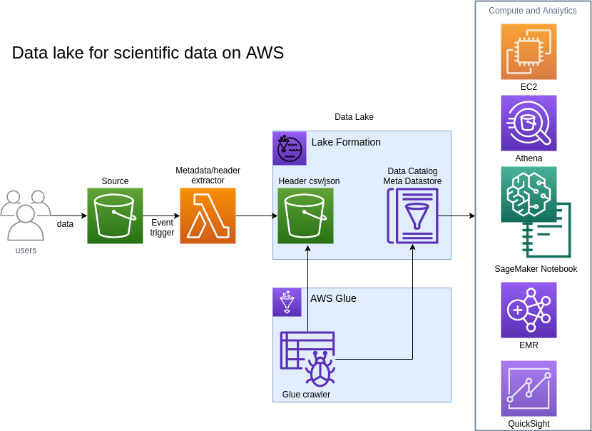

# Welcome to FITS Data lake project. 

## Introduction 
Flexible Image Transport System (FITS) is the most commonly used file format in astronomy. Each FITS file contains one or more ASCII headers (metadata) and a binary data section as multi-dimensional array or tables. 
Information about the data itself, such as instrument configuration, observation details, image origin, rize and coordinates, are stored in the headers as key value pairs. 

Self-contained metadata format makes it possible for easy transport and sharing, it also provide challenges on the searchability and managibility of the data, especially when you are working on a large amount of data from different satallites or instruments. 

Data lake is a centralized data repository, which has gain popularity in recently years as the size of the data grow exponentially in all industries. Unlike traditional data warehouse where high peformance relational database ( can be very expensive at large scale ) are used to store data in a central location and with pre-determined schema, data lake takes advantage of existing storage and centralize data schema in a data catalog. For example, to build a data lake on AWS, you can put structured or unstructed data in Amazon Simple Storage Service (Amazon S3) with different schema, automate an ETL crawler to aggregate the schemas into a fully managed data catalog. Then you can run sql querie against the data catalog and process your data. 

Data lake has been used mostly in data analytics so far. In this solution, however, we will apply the concept and practice of building a serverless data lake in AWS cloud for FITS data. This approach can be applied to most of the scientific data, which containes metadata within or with external attachment of metadata files. 


## About CDK
This project is built with AWS Cloud Development Kit (CDK) using Python. AWS CDK is an open source software development framework you can use to build and deploy your cloud infrastrures and application resources using your favorite programming language (as an alternative to using AWS CloudFormation). For more detailed information about AWS CDK, please visit https://aws.amazon.com/cdk/. 

Assume you have installed cdk and aws cli on the computer you are working on. 

### CDK project basics
The current fold structure is part of the scaffolding created using the following command. 
```
cdk init app --language python
```
Project code/test data are added on top 
<pre>
project_folder/
|-- fits_data/                      # sample FITS files
    |-- fits_samples/
    |-- hubble_samples/
    |-- turorials/
|-- images/
|-- my_fits_datalake/
    |-- my_fits_datalake_stack.py   # the FitsDatalakeStack code
!-- notebooks/                      # test jupyter notebook
|-- python/                         # astropy package source
|-- resources/
    |-- fits_header_extractor       # lambda code for extracting FITS header info
|-- resources_layer/
    |-- astropy.zip                 # astropy package zip (zip of the python folder)
|-- app.py                          # CDK app code
|-- cdk.json                        # CDK config
|-- .git/
|-- .gitignore
|-- test/
|-- README.md
|-- requirements.txt
|-- setup.py
|-- source.bat 
</pre>

#### Virtual environment

This project is set up like a standard Python project.  The initialization
process also creates a virtualenv within this project, stored under the .env
directory.  To create the virtualenv it assumes that there is a `python3`
(or `python` for Windows) executable in your path with access to the `venv`
package. If for any reason the automatic creation of the virtualenv fails,
you can create the virtualenv manually.

To manually create a virtualenv on MacOS and Linux:

```
$ python3 -m venv .env
```

After the init process completes and the virtualenv is created, you can use the following
step to activate your virtualenv.

```
$ source .env/bin/activate
```

If you are a Windows platform, you would activate the virtualenv like this:

```
% .env\Scripts\activate.bat
```

Once the virtualenv is activated, you can install the required dependencies.

```
# after installing all needed packages, run freeze to create the requirements.txt for deployment on another environment
$ pip freeze > requirements.txt
# on a new environment 
$ pip install -r requirements.txt
```

#### CDK configuration file
The `cdk.json` file tells the CDK Toolkit how to execute your app when you run `cdk deploy`.

#### Setup project parameters in app.py
The default project stack name is "my-fits-datalake", which will be used as the name of the CloudFormation template stack name and prefix for many of the resources created. You can change that to whatever you like in app.py

```
source_bucket_name = "fits-source-bucket"    #This is where your source FITS files are stored or will be stored.
glue_database_name = "fits_datalake"        #This is the name of the database for the data catalog 

MyFitsDatalakeStack(app, "my-fits-datalake", source_bucket_name=source_bucket_name, glue_database_name=glue_database_name)
```

There are two prameters you need to set for your own project. Please change them accordingly

#### Synthesize and deploy the project
At this point you can now synthesize the CloudFormation template for this code.

```
$ cdk synth
$ cdk deploy  my-fits-datalake -y
```

#### Additional dependencies
To add additional dependencies, for example other CDK libraries, just add
them to your `setup.py` file and rerun the `pip install -r requirements.txt`
command.

#### After your deploy the project
If you already have FITS files in your fits-source-bucket, run the following aws cli command
```
aws s3 cp --recursive --metadata {\"touched\":\"true\"} s3://<fits-source-bucket>/ s3://<fits-source-bucket>/
```
This will "touch" all the existing FITS files in the source bucket and trigger the header extraction lambda function to create header csv files in the <fits-destination-bucket>. 


## FITS Datalake Project

### Architecture



Let's walk through what happens when a FITS file is uploaded to the source bucket

- S3Put Event triggers the header extractor lambda function 
- FITS header is extracted and saved into a csv file to the destination bucket
- AWS Glue crawler update the database tables in AWS Glue data catalog


The main resources involved in this reference architecture
1. Amazon S3 bucket - existing source bucket (<fits-source-bucket>) - this is where FITS files are stored or will be added to. You can use folder structure inside the bucket. the folder name and file name of a FITS file will become part of the schema
2. Amazon S3 bucket - created destination bucket (<fits-destination-bucket>) 
3. AWS Glue crawer
4. AWS Glue database and tables in AWS Glue data catalog


### Create a layer for the lambda function

```
$ mkdir resoures_layer
$ mkdir python
$ pip install aws_cdk.aws_lambda aws_cdk.aws_s3
$ pip install astropy --target python
$ zip -r9 resources_layer/astropy.zip python
```
use resources_layer/astropy.zip to create a new layer

```
        layer_astropy = lambda_.LayerVersion(self, 'AstroFitsioLayer', 
            code=lambda_.Code.from_asset("resources_layer/astropy.zip"),
            compatible_runtimes=[lambda_.Runtime.PYTHON_3_7]
        )
       # use an AWS provided layer for numpy
        layer_numpy = lambda_.LayerVersion.from_layer_version_arn(self, "NumpyLayer", "arn:aws:lambda:us-east-1:668099181075:layer:AWSLambda-Python37-SciPy1x:22")
```
Astropy depends on Numpy package, furtunately AWS has a public layer available (arn:aws:lambda:us-east-1:668099181075:layer:AWSLambda-Python37-SciPy1x:22)
